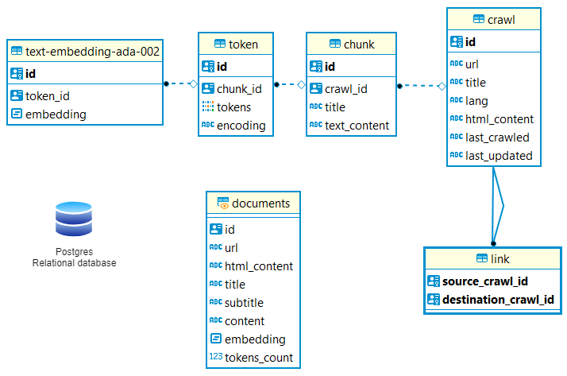

# What is louis-db ?

Louis-db is the database of [Louis](https://github.com/ai-cfia/louis). It includes all of the python and bash scripts as well as sql functions. It uses ada-002 API (Application Programming Interface) for semantic search. 

- The *bin* folder : This folder contains all of the bash scripts that would be useful to set up the database.

- The *louis* folder : This folder contains python files that allows connections to the database or the api.

- The *postgres* folder : This folder contains the bash script that will set up the docker container.

- The *sql* folder : This folder holds all of the sql functions and scripts.

- The *tests* folder : This is the test folder, it allows you to test the code.

Here is the database schema :


If you need to set up the database locally, please follow [this procedure](https://dev.azure.com/CFIA-DevOps-ACIA/AI-Lab/_wiki/wikis/AI-Lab.wiki/1039/Procedure-to-set-up-the-database-locally).


# Workflow

## Installing python package

If you need to interface with the database, use this to install:

```
pip install git+https://github.com/ai-cfia/louis-db@v0.0.5-alpha3
```

You'll often want to add, move or modify existing database layer functions found in louis-db from a client repository.

To edit, you can install an editable version of the package dependencies such as:

```
pip install -e git+https://github.com/ai-cfia/louis-db#egg=louis_db
```

this will checkout the latest source in a local git in src/louis-db allowing edits in that directory to be immediately available for use by louis-crawler.

Don't forget to create a PR with your changes once you're done!