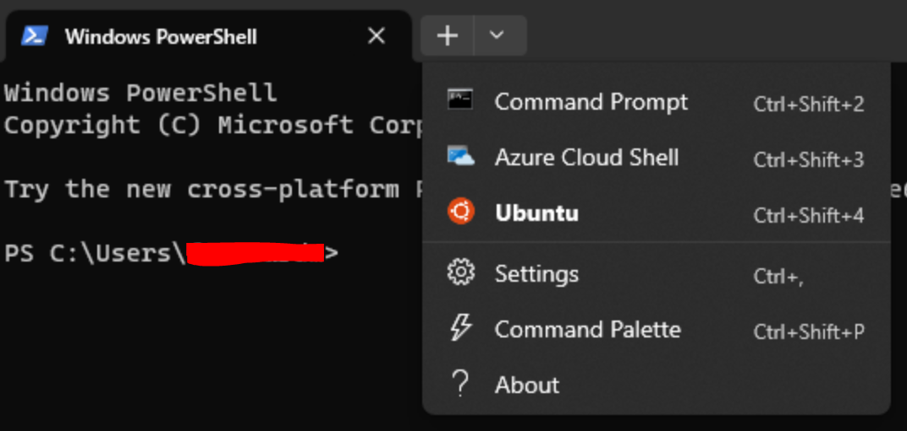
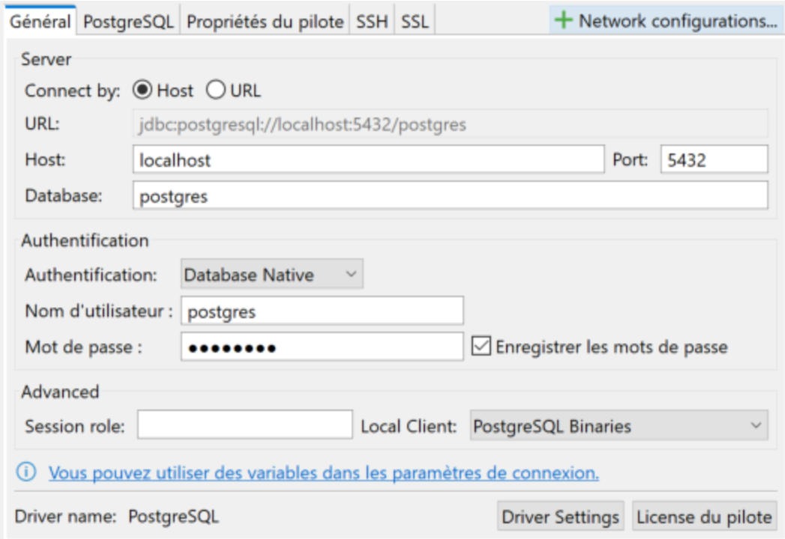
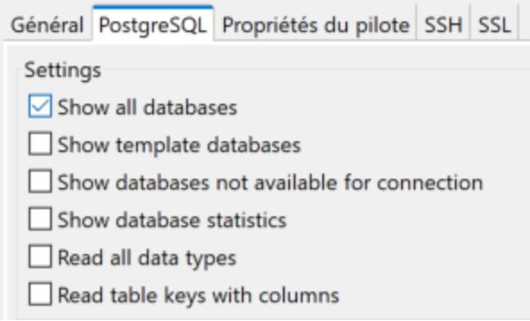

# First time set up
First you should have [Visual Studio Code](https://dev.azure.com/CFIA-DevOps-ACIA/AI-Lab/_wiki/wikis/AI-Lab.wiki/975/Visual-Studio-Code) installed and [WSL](https://dev.azure.com/CFIA-DevOps-ACIA/AI-Lab/_wiki/wikis/AI-Lab.wiki/983/WSL-Windows-Subsystem-Linux) and [Docker](https://dev.azure.com/CFIA-DevOps-ACIA/AI-Lab/_wiki/wikis/AI-Lab.wiki/981/Docker) set up.

Once you're on VS Code, you have to do the following : 

- Go to view > Command palette (Ctrl+Shift+P) and type in WSL and choose the "Connect to WSL" option
- Inside VS Code, navigate to View and choose "Terminal"
- Type "cd" to return to your $HOME folder.
- Create a new directory by typing "mkdir src" (if this folder already exist, skip this step).

Once you did that, you can move to your src folder with `cd src` and then clone the repository of your choice. Here, we will use the [ailab-db repository](https://github.com/ai-cfia/ailab-db). **Don't forget to configure your git globally.**

Move inside of this folder with `cd ailab-db`. Then, ensure that you are inside of the "Dev Container : Python3" (this should appear at the **bottom left** of your VS Code window):


If not, run the following command in the command palette (Ctrl+Shift+P) :
```shell
Dev Containers: Rebuild and Reopen in container
```

**If it's still not working**, ensure that you are inside the ailab-db folder and not src. If you are indeed in src, do the following : `cd src/ailab-db` and then `code .`

When done, open a terminal **outside** of VS Code (should be a Windows PowerShell) and change it to the ubuntu one:



Then enter these commands one after another (it will allow you to launch the container for the database):
```shell
cd src/ailab-db/postgres
./build-louis-postgres.sh
```

Then you need to run these commands : 
```shell
cd ../bin
./install-postgresl-client-15.sh
```

Congratulations, you can pursue this procedure !

# To do every time you want to load the data

These are the steps to setup the database and load the actuals schema and data, launch each script separately and watch out for errors:
```shell
./postgres.sh
./setup-db-docker.sh
./load-versioned-schema.sh database-name (here, louis_v005)
./load-versioned-data.sh database-name (here, louis_v005)
```

--- 

## If you have an error similar to this one:


Check the `.env` file to complete what's needed. If you do not have a .env file, create one at the **root of the project** and add the content of the `.env.template` file. Fill what you need to pursue, you can use the DEVELOPER.md file to understand what you should put in each variable (PGDATA can stay empty).

--- 

If everything went well, open DBeaver and create a new connection as shown here:



Your password should be the same as the one in .env file in the POSTGRES_PASSWORD variable.

Ensure that the following settings are checked:



Congratulation, your database is all setup, you're ready to go!
